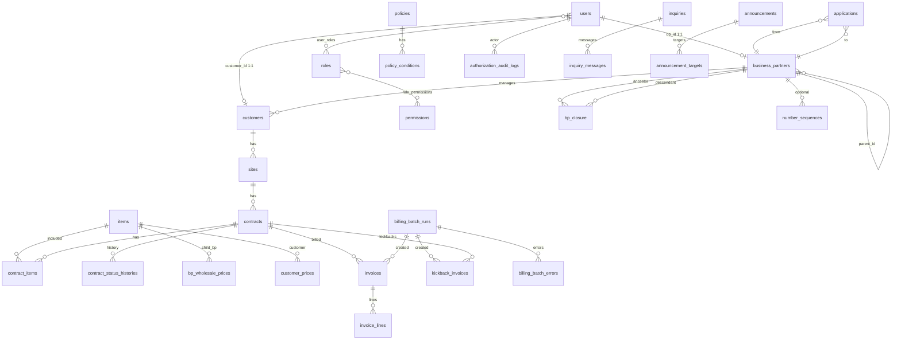

# DBスキーマ概要・ER図

文字セット: **utf8mb4**  
デフォルト照合: **utf8mb4_uca1400_ai_ci**  
識別子系カラム: **utf8mb4_bin**（アプリ正規化 + 厳密比較）  
タイムゾーン: Asia/Tokyo（DB `+09:00`）

---

## ER図（論理）

---

## 領域別テーブル一覧

### A. 認証・IAM

#### `users`
| カラム | 型 | 備考 |
|--------|-----|------|
| id | BIGINT PK | |
| login_id | VARCHAR(64) UNIQUE, bin | 正規化済み |
| password | VARCHAR(255) | hashed |
| user_type | ENUM('admin','bp','customer') | |
| bp_id | BIGINT NULL FK | BPユーザー必須、1:1 |
| customer_id | BIGINT NULL FK | カスタマー種別のとき必須 |
| name | VARCHAR(255) | |
| email | VARCHAR(255) NULL | |
| two_factor_secret | TEXT NULL | 暗号化推奨 |
| two_factor_mode | ENUM('forced','optional','disabled') NULL | **adminのみ**。NULL=optional |
| two_factor_confirmed_at | TIMESTAMP NULL | 有効化済み |
| two_factor_forced_disabled | BOOLEAN DEFAULT false | 管理者緊急スキップ |
| must_change_password | BOOLEAN DEFAULT false | |
| password_changed_at | TIMESTAMP NULL | |
| is_active | BOOLEAN | |
| last_login_at | TIMESTAMP NULL | |
| timestamps / deleted_at | | soft delete 推奨 |

CHECK:  
`(user_type='admin' AND bp_id IS NULL AND customer_id IS NULL)` 等をアプリで強制。DB CHECK は Phase 2 で検討。

#### `roles` / `permissions` / `role_permissions` / `user_roles`
→ [IAM設計](../iam/iam-design.md)

#### `policies` / `policy_conditions`
→ ABAC 本体。[IAM設計](../iam/iam-design.md)

#### `number_sequences`
| カラム | 型 | 備考 |
|--------|-----|------|
| id | PK | |
| prefix | VARCHAR(8), bin | `BPN` / `CN` |
| year_month | CHAR(6), bin | `YYYYMM` |
| last_seq | INT UNSIGNED | |
| UNIQUE(prefix, year_month) | | |

#### `authorization_audit_logs` / `activity_logs`
認可結果・管理者特権・重要CRUD・ログイン成否の監査。

- **管理者画面**（`/admin/audit-logs`）から一覧・フィルタ・詳細参照可能（permission: `audit.log.view`）
- 画面からの編集・削除は不可（参照専用）。詳細は [IAM設計](../iam/iam-design.md)

---

### B. BP・顧客

#### `business_partners` / `bp_closure`
→ [BP階層設計](../bp/hierarchy-design.md)

追加（2FA）: `business_partners.two_factor_mode` ENUM(`forced`,`optional`,`disabled`) DEFAULT **`optional`**  
当該BPのユーザーに適用。カスタマーは `customers.two_factor_mode` で独立管理。詳細は [IAM設計](../iam/iam-design.md)。

連絡先（発行者情報・Phase 7）: `postal_code` / `address` / `building_name` / `phone` / `email`

#### `customers`
| カラム | 型 | 備考 |
|--------|-----|------|
| id | PK | |
| code | VARCHAR(32) UNIQUE, bin | CN |
| managing_bp_id | BIGINT FK | 所属BP |
| name / name_kana | | |
| postal_code | VARCHAR(16) | |
| address | VARCHAR(500) | |
| phone / email | | |
| entity_type | ENUM('individual','corporate') | 個人/法人 |
| two_factor_mode | ENUM('forced','optional','disabled') | DEFAULT **optional**。CN単位 |
| is_active | | |
| timestamps | | |

#### `sites`（拠点）
| カラム | 型 | 備考 |
|--------|-----|------|
| id | PK | |
| customer_id | FK | |
| name | | |
| postal_code / address / building_name / phone | | 設置先（建物名は別項目） |
| billing_name | VARCHAR | 請求書送付先宛名 |
| billing_department | VARCHAR NULL | 請求書送付先部署 |
| billing_postal_code / billing_address / billing_building_name / billing_phone | | 請求書送付先（設置先と独立） |
| is_primary | BOOLEAN | 1カスタマーにつき最大1件 |
| is_active | BOOLEAN | |
| timestamps | | |

---

### C. 品目・価格

#### `items`
| カラム | 型 | 備考 |
|--------|-----|------|
| id | PK | |
| code | VARCHAR(64) UNIQUE, bin | `{YYMM}{seq3}` 例 `2609001` |
| name / description | | |
| billing_type | ENUM('initial','running') | イニシャル / ランニング |
| required_item_id | FK items NULL | 必須セット品目（循環禁止） |
| partition_price | DECIMAL(12,2) | 標準仕切り（卸未設定時のフォールバック） |
| recommended_price | DECIMAL(12,2) | 推奨価格（参照のみ。計算には使わない） |
| user_price | DECIMAL(12,2) | ユーザー標準（カスタマー売価の既定・税別整数） |
| tax_rate | TINYINT | 消費税率％（既定10） |
| is_active | | |
| softDeletes | | |

価格の使い分け: [pricing.md](../architecture/pricing.md)

#### `bp_wholesale_prices`
親BPが **直接の子BP** に設定する卸（仕切り）価格。金額は品目あたり1本。  
UNIQUE(item_id, seller_bp_id, buyer_bp_id)  
ABAC: `depth_diff = 1` のみ編集可。未設定時は `items.partition_price` を表示。

#### `customer_prices`
BPがカスタマーへ設定する請求額。金額は品目あたり1本（区分は品目の billing_type）。  
UNIQUE(item_id, bp_id, customer_id)  
未設定時は `items.user_price` を表示。

---

### D. 契約・申請

#### `contracts`
| カラム | 型 | 備考 |
|--------|-----|------|
| id | PK | |
| code | VARCHAR UNIQUE bin | `CTR{YYYYMM}{seq}` |
| site_id | FK | |
| customer_id | FK | 冗長保持 |
| owning_bp_id | FK | 契約管理BP |
| status | VARCHAR(32) | draft（表示: オーダー作成中）/ pending_price_approval / approved / activated / cancelled |
| applied_at / activated_at | | |
| softDeletes | | |

#### `contract_items`
| カラム | 型 | 備考 |
|--------|-----|------|
| id | PK | |
| contract_id / item_id | FK | |
| unit_price | DECIMAL | カスタマー請求額 |
| partition_price | DECIMAL | 仕切り（承認前変更可） |
| price_locked | BOOL | 承認後 true |

#### `contract_status_histories`
ステータス遷移履歴（from/to, actor, note）。

#### `applications`（階層申請WF）
| カラム | 型 | 備考 |
|--------|-----|------|
| id | PK | |
| type | VARCHAR | `price_approval` / `price_change` |
| contract_id | FK | |
| from_bp_id / to_bp_id | FK | 下位→上位 |
| status | | pending / approved / rejected |
| payload_json | JSON | 変更後の明細価格など |
| amount | DECIMAL NULL | ABAC用（合計等） |

#### `data_field_names`
契約データの名称マスタ（管理者管理）。`replace_code`（英小文字＋`_`、一意。予約語不可）。

#### `contract_item_data`
契約明細ごとの **名称:値**。`data_field_name_id` 任意（マスタ参照）。名称はマスタ外の直接入力も可。マスタ外は `replace_code` 必須。品目あたり最大10行。

#### `contract_data`
契約全体の共通 **名称:値**（全品目テンプレに適用）。品目データと同コードの場合は品目側優先。最大10行。

#### `item_documents`
品目に紐づく **Documentテンプレート**（開通案内・保守・保証書など）。**Excel / XML / HTML のみ・品目あたり最大5**。契約時に置換→PDF化される。

#### `contract_item_documents`
契約明細に発行された **PDF**（画面確認・ダウンロード用）。再生成は上書き。

---

### E. 請求（Phase 7 基盤 → Phase 10 拡張）

#### `invoices`
| カラム | 型 | 備考 |
|--------|-----|------|
| id | PK | |
| code | VARCHAR UNIQUE | `INV{YYYYMM}{seq}` |
| contract_id / customer_id / owning_bp_id | FK | |
| issuer_bp_id | FK | ルートBP（発行主体） |
| source | VARCHAR(16) | 既定 `auto` |
| billing_batch_run_id | FK NULL | 生成実行 |
| billing_year_month | CHAR(6) | YYYYMM |
| due_year_month | CHAR(6) | 請求月の翌月 |
| status | VARCHAR | issued / paid / withdrawn |
| subtotal / tax_total / total | BIGINT | 円（整数・税別／税／税込） |
| paid_amount | BIGINT NULL | 入金金額（税込）。キックバック按分の分子 |
| issued_at / paid_at / withdrawn_at | | |
| softDeletes | | |

金額は契約明細の **`unit_price`（EU単価）**。仕切りはキックバック計算用。

#### `invoice_lines`
品目明細（イニシャルは開始月＋未請求時のキャッチアップ、ランニングは対象月）。

#### `billing_batch_runs`
| カラム | 備考 |
|--------|------|
| billing_year_month | 対象請求月 |
| trigger | `manual` / `scheduled` |
| status | `success` / `partial` / `failed` |
| actor_user_id | 手動時の実行者 |
| invoices_count / kickbacks_count / skipped_count / errors_count | |
| started_at / finished_at | |

#### `billing_batch_errors`
実行に紐づく契約単位エラー（phase: `customer_invoice` / `kickback`）。

#### `kickback_invoices` / `kickback_invoice_lines`
BP 間キックバック。`from_bp_id`（上位・支払）→`to_bp_id`（下位・受取）、`source_invoice_id`（対象カスタマー請求＝バッチ月の6ヶ月前）、`billing_batch_run_id`、ステータスは invoices と同様（issued/paid/withdrawn）。金額は対象請求の税込入金按分（未入金は0）。管理者は `manual_adjusted` で端数調整可。

#### `contract_item_price_layers`
価格承認時の仕切りスナップショット（seller/buyer/amount/depth_from_root）。

#### `system_settings`
key-value。自動請求スケジュールは key=`billing_batch_schedule`。

---

### F. 問い合わせ・お知らせ・チケット

#### `inquiries`（Phase 9 でチケット化）
受領／発行・ステータス（起票／取下／対応中／クローズ）・添付。ルート名は `*.tickets.*`。詳細は [phase9-setup.md](../architecture/phase9-setup.md)。

#### `inquiry_messages`
チケットスレッドのメッセージ（テキスト＋任意添付）。

#### `announcements`
| カラム | 型 | 備考 |
|--------|-----|------|
| id | PK | |
| title / body | | |
| published_at | TIMESTAMP | 即時または予約 |
| expires_at | TIMESTAMP NULL | |
| created_by_user_id | FK users | |
| owning_bp_id | FK NULL | 管理者作成は NULL |
| softDeletes / timestamps | | |

#### `announcement_targets`
`target_type`: `all` \| `all_bp` \| `all_customer` \| `bp` \| `customer` 等。

#### `announcement_reads`
ユーザー単位既読（`announcement_id` + `user_id` UNIQUE）。

---

### G. インデックス方針（要点）

- すべての FK に INDEX
- `bp_closure(ancestor_id, depth_diff)` / `(descendant_id)`
- `contracts(owning_bp_id, status)`, `contracts(customer_id)`
- `invoices(billing_batch_run_id)`, `invoices(contract_id, billing_year_month)`
- `inquiries(owning_bp_id, status, updated_at)`
- 識別子 UNIQUE は bin 照合のカラムで定義

---

## 物理実装タイミング

| Phase | マイグレーション対象 |
|-------|----------------------|
| 2 | users, IAM, ABAC, number_sequences, audit |
| 3 | business_partners, bp_closure, customers, sites |
| 4 | items, prices |
| 5 | contracts, applications, PDF関連メタ |
| 6 | inquiries, announcements |
| 7 | replace_code, invoices / invoice_lines, BP連絡先 |
| 8 | （主に権限・UI。スキーマ追加は軽微） |
| 9 | inquiries 再編（チケット） |
| 10 | 契約請求フラグ、issuer、kickbacks、system_settings、billing_batch_runs、batch_run_id |

本ドキュメントは論理設計と実装の対照用。詳細カラムは各 Phase のマイグレーションを正とする。
